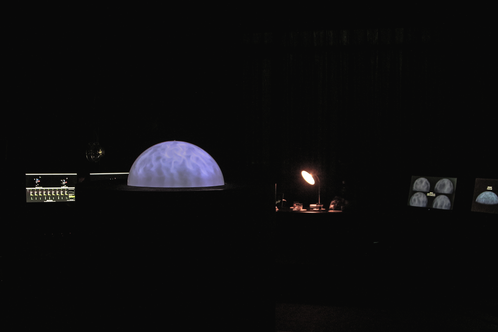
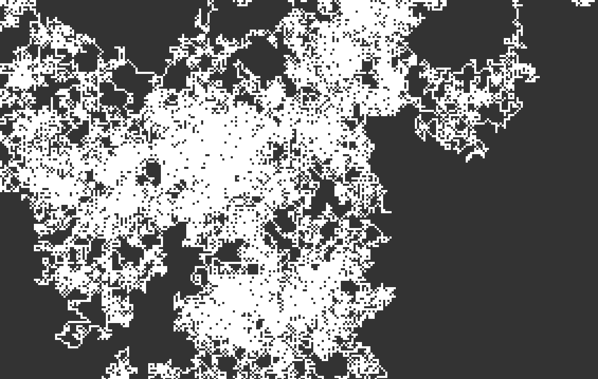

**김성백** 
 Visual Media High School / *Media Contents major*  
 Seoul Institute of the Arts / *Digital Arts major*

《Fluid : A living planet》 (2019, 남산예술센터, 서울)

《VR이 도덕적 이탈에 미치는 영향에 대한 실험》 (2018, ZER01NE, 서울)

 
 
 **작업설명**  
 Project_Post_Pixel은 Post Human처럼 단순한 픽셀이 인간의 의도로 코드를 부여받으면서 픽셀을 초월한다는 개념으로 접근한 연작입니다.
 모든 코드는 Poetic Code로써 기능적으로는 작동하지 않는 코드이며, 코드 안에 의미를 담고자 노력했습니다.
  
 > *나에게 움직이지 않는 한 점만 달라. 그러면 지구를 움직일 것이다. -아르키메데스*

 
 **작업**

**[심장 : 생존기관](./PPP_Heart.md/)**
 * 콩닥콩닥 뛰면서 생명력을 만들어내는 심장을 코드화하였다.
 * ba_boom이라는 의성어를 중심으로 그것을 정의내리고 갈망하는 과정을 통해 스스로 생각하고 움직이는 심장을 만들었다. 구조적으로 심장과 동일하기보단 상징적으로 접근하였다.
 * 신체기관으로서의 역할을 가지게 된 코드는 기능적으로 무의미하더라도 유의미하다고 생각했다.
  
  

 ---
**[기氣 : 감각기관](./PPP_Ki.md/)**
 * 생명의 근원이자 몸에 흐른다는 기를 코드화하였다.
 * 기(氣)는 여러 기관을 타고 흐르며 멀리 떨어져있는 기관과도 기를 통해 상호작용할 수 있다. 이런 점이 마치 코드가 다른 함수를 호출하고 상호작용하는 것과 비슷한 느낌을 가진다.
 * 구조적으로는 function draw와 크게 다르지 않다. 그러나 이것이 기로써 작동할 때 다른 의미를 갖는다고 생각했다.
 * 기존에 만든 심장과 상호작용한다.

 ---
**[인식 : 감각기관](./PPP_Perception.md/)**
 * 코드 간의 상호작용을 '인식'으로 생각하고 이를 코드화하였다.
 * Mashour G A, Alkire M T, RNAS, 2013에 따르면 의식의 원래 기능은 움직일 수 있는 자신이 에너지가 부족해지면 에너지원을 찾게 하는 것이었을 거라고 한다. 즉 의식은 최초에는 주변 환경을 인식함으로써 먹이를 찾는 것에 불과했다.
 * 코드끼리의 인식과 상호작용은 당연한 것이지만 그것을 구체화하고 인식이라는 이름으로 정의내렸을 때에는 분명히 다른 점이 생긴다고 생각했다.
 * 기존에 만든 심장과 상호작용한다.
 * [코드실행](./PPP_Perception/)

 ---
 **[Pixel Generator](./pixelGenerator/)**
  * 무작위로 생성되는 픽셀들이 이미지를 창조한다.
  * 아주 단순한 규칙 아래에서 픽셀들은 창발적인 움직임을 만들어나간다.
  
  
<!--
 ## Work
  * [예시 작업](./example/)
  * 여러분의 작업을 p5 기반으로 만들고 링크를 걸 수 있습니다.
  * 다음처럼 이미지를 추가할 수도 있습니다.

   -->
